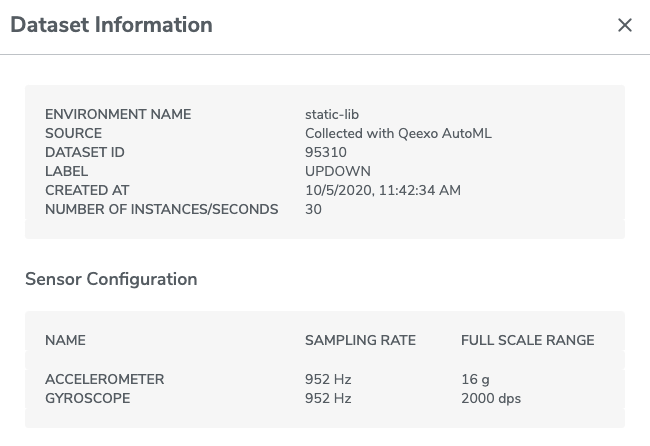

# How to use machine learning models built on Qeexo AutoML to design a custom application on the Arduino Nano 33 BLE Sense

Please note that models can only be exported if they were created in Qeexo AutoML with the **Arduino Nano 33 BLE Sense** hardware.
The below has been tested on macOS Catalina 10.15.5 and Windows 10 version 2004.

# macOS 

## Step 1. Set Up the Environment
### 0. Setup software utilities
You will need Python 3.7 or 3.8. If you do not have it installed already, download at this [link](https://www.python.org/downloads/release/python-387/).

### A. Clone the Qeexo-provided reference code into your working environment
1. Open `Terminal` and navigate to a directory of your choice, e.g. `~/QeexoAutoML/Arduino/`.
2. Execute the following command to clone the [Qeexo_AutoML_Arduino_Nano33BLE_pub](https://github.com/qeexo/Qeexo_AutoML_Arduino_Nano33BLE_pub) repository:

`git clone https://github.com/qeexo/Qeexo_AutoML_Arduino_Nano33BLE_pub.git automl-arduino-nano-33ble-sense`

### B. Install Arduino and other required dependencies
1. Change directory to `automl-arduino-nano-33ble-sense` by issuing the command: `cd automl-arduino-nano-33ble-sense`

2. Run the Arduino installer script: `./automl-install.sh` to download Arm's mbed core code along with the necessary software tools for our Arduino Nano 33 BLE Sense project. This may take some time.


## Step 2. Download the Machine Learning Static Library from Qeexo AutoML

This step assumes that you have already built a model in Qeexo AutoML. For details on how to create a model, refer to the [Qeexo AutoML User Guide](https://qeexo-auth0.s3.us-east-2.amazonaws.com/QeexoAutoML_User_Guide.pdf). 

1. Login to [Qeexo AutoML](https://automl.qeexo.com), open your desired project, then navigate to the `Models` tab. 

2. Hover the mouse pointer over the SAVE icon of the desired model, then click on `save .a` to download:


Your static library will be named `<project-name>-<model-name>-1.0-static.a` and saved to your download directory.


## [OPTIONAL] Step 3. Test Your Setup with the Qeexo-Provided Reference Application

Qeexo's code repository includes a default machine learning static library, `libs/libQxClassifyEngine.a`, for testing your setup. If you want to build your own custom application right away, please proceed to Step 4.

If you want to test Arduino Nano 33 BLE Sense with Qeexo's battery box, proceed to step 1a; otherwise proceed to step 1b.

1a. In the main directory `automl-arduino-nano-33ble-sense`, run: `./automl-build.sh -bb` to build the default Arduino application to run with Qeexo's battery box.

1b. In the main directory `automl-arduino-nano-33ble-sense`, run: `./automl-build.sh -b` to build the default Arduino application without Qeexo's battery box.

2. Ensure that the Arduino Nano 33 BLE Sense hardware is connected to your computer via USB.

3. Flash the binary with: `./automl-build.sh -f`.

4. To see the output of the live classification, run: `./automl-build.sh --debuglog`. 

5. The classification inference should now be running continuously on-device. You should see the amber LED turn OFF when the device is at rest, and turn ON when the device is tapped or moved. 


## Step 4. Modify the Arduino .ino File with Your Own Custom Application

### A. Modify the source code with the correct sensor configurations

The sensor configurations (Output Data Rate and Full Scale Range of the accelerometer and gyroscope) must be updated in `QxAutoMLInf.cpp` to match the values selected when the machine learning model was built in Qeexo AutoML. The default is set at 16 g and 952 Hz for the accelerometer and 2000 dps and 952 Hz for the gyroscope. 

You can find the sensor configurations for your data by going to the `Training` tab, and clicking on the "Click for details" text under the Data Information column: 


If applicable, update the following code to match the sensor configuration in your project:
```cpp
void QxAutoMLInf::sensorInit(void)
{
    /* init and enable accelerometer & gyroscope */
    if (mAccelData) {
        lsm9ds1_acc_init(NULL);
        lsm9ds1_acc_enable(NULL,
                          16.0,    /* ACCEL FULL SCALE RANGE */
                          952.0,   /* ACCEL SAMPLING RATE */
                          TRUE);
    }
    if (mGyroData) {
        lsm9ds1_gyro_init(NULL);
        lsm9ds1_gyro_enable(NULL,
                            2000.0, /* GYRO FULL SCALE RANGE */
                            952.0,  /* GYRO SAMPLING RATE */
                            TRUE);
    }
    if (mMagData) {
        lsm9ds1_mag_init(NULL);

         /* MAG's params are fixed values */
         lsm9ds1_mag_enable(NULL, 16.0, 100.0, FALSE);
    }
    if (mPCMData) {
        mp34dt05_microphone_init(NULL);
    
        /* MIC's params are fixed values */
        mp34dt05_microphone_enable(NULL, 32768.0f, 16000.0f, FALSE);
    }
}
```

Note that there is no need to change the sensor configurations for the magnetometer and microphone because they are fixed. 
We have provided 4 sensors in this sample file: *accelerometer, gyroscope, magnetometer, and microphone*. We will be adding more sensor support in the next release.

### B. Edit the Arduino .ino file

You have two Sketch files to choose from:

* If you plan to use the Qeexo-branded battery box, use the Arduino IDE or another editor of your choice to open automl-arduino-nano-33ble-sense-battery.ino.qeexo to code your custom application. Be sure to save it with .ino extension.
* If you do not plan to use the Qeexo-branded battery box or unsure what the battery box is, use the Arduino IDE or another editor of your choice to open automl-arduino-nano-33ble-sense-no-battery.ino.qeexo to code your custom application. Be sure to save it with .ino extension.

The supplied Sketch file  turns the on-board amber LED ON/OFF depending on the classification results. 
`Class 0` will turn the LED OFF; any other class will turn the LED ON. This should be consistent with what you have observed in Step 3 above. 

Note that the classes are currently mapped alphabetically, from `0` to `n-1`, where n is the number of defined classes. For example, if you labled your classes `RUNNING`, `JUMPING`, and `IDLE`, their respective classes will be `2`, `1`, and `0`. In the future we will print this mapping for your convenience.


### C. Compile and flash the custom application to the Arduino Nano 33 BLE Sense hardware

1. Copy the `.a` file from Step 2 above into your working directory, `automl-arduino-nano-33ble-sense`.  

2. Compile your custom application with this command: `./automl-build.sh -b <project-name>-<model-name>-1.0-static.a`, while replacing the .a library file with its actual name. 

3. Ensure that the Arduino Nano 33 BLE Sense hardware is connected to your computer via USB.

4. Flash the binary with: `./automl-build.sh -f`.

5. To see the output of the live classification, run: `./automl-build.sh --debuglog`. 

Congratulations! You have now built a custom application powered with machine learning.

# Windows 10

## Step 1. Set Up the Environment

### 0. Setup Software Utilities
1. You need access to `git`. We recommend [git for Winodws](https://git-scm.com/download/win). Conveniently it comes with `git bash` which you will need to execute all commands described below.
2. Install ARMmbed Command Line Interface tools from this [link](https://github.com/ARMmbed/mbed-cli-windows-installer/releases/download/v0.4.10/Mbed_installer_v0.4.10.exe). 
3. You will need Python 3.7 or 3.8. If you do not have it installed already, download at this [link](https://www.python.org/downloads/release/python-387/).

### A. Clone the Qeexo-provided reference code into your working environment
1. Open `git bash` by pressing "Win + S" and typing "git bash". 
2. Navigate to a directory of your choice, e.g. `/c/Users/xyz/Qeexo/`.
3. Execute the following command to clone the [Qeexo_AutoML_Arduino_Nano33BLE_pub](https://github.com/qeexo/Qeexo_AutoML_Arduino_Nano33BLE_pub) repository:

`git clone https://github.com/qeexo/Qeexo_AutoML_Arduino_Nano33BLE_pub.git automl-arduino-nano-33ble-sense`

### B. Install Arduino and other required dependencies
1. Change directory to `automl-arduino-nano-33ble-sense` by issuing the command in `git bash`: `cd automl-arduino-nano-33ble-sense`

2. Run the Arduino installer script: `./automl-install.sh` to download Arm's mbed core code along with the necessary software tools for our Arduino Nano 33 BLE Sense project. This may take some time.

## Step 2. Download the Machine Learning Static Library from Qeexo AutoML

This step assumes that you have already built a model in Qeexo AutoML. For details on how to create a model, refer to the [Qeexo AutoML User Guide](https://qeexo-auth0.s3.us-east-2.amazonaws.com/QeexoAutoML_User_Guide.pdf). 

1. Login to [Qeexo AutoML](https://automl.qeexo.com), open your desired project, then navigate to the `Models` tab. 

2. Hover the mouse pointer over the SAVE icon of the desired model, then click on `save .a` to download:


Your static library will be named `<project-name>-<model-name>-1.0-static.a` and saved to your download directory.


## [OPTIONAL] Step 3. Test Your Setup with the Qeexo-Provided Reference Application

Qeexo's code repository includes a default machine learning static library, `libs/libQxClassifyEngine.a`, for testing your setup. If you want to build your own custom application right away, please proceed to Step 4.

If you want to test Arduino Nano 33 BLE Sense with Qeexo's battery box, proceed to step 1a; otherwise proceed to step 1b.

1a. In the main directory `automl-arduino-nano-33ble-sense`, run: `./automl-build.sh -bb` to build the default Arduino application to run with Qeexo's battery box..

1b. In the main directory `automl-arduino-nano-33ble-sense`, run: `./automl-build.sh -b` to build the default Arduino application without Qeexo's battery box.

2. Ensure that the Arduino Nano 33 BLE Sense hardware is connected to your computer via USB.

3. Flash the binary with: `./automl-build.sh -f`.

4. To see the output of the live classification, run: `./automl-build.sh --debuglog`. 

5. The classification inference should now be running continuously on-device. You should see the amber LED turn OFF when the device is at rest, and turn ON when the device is tapped or moved. 


## Step 4. Modify the Arduino .ino File with Your Own Custom Application

### A. Modify the source code with the correct sensor configurations

The sensor configurations (Output Data Rate and Full Scale Range of the accelerometer and gyroscope) must be updated in `QxAutoMLInf.cpp` to match the values selected when the machine learning model was built in Qeexo AutoML. The default is set at 16 g and 952 Hz for the accelerometer and 2000 dps and 952 Hz for the gyroscope. 

You can find the sensor configurations for your data by going to the `Training` tab, and clicking on the "Click for details" text under the Data Information column: 


If applicable, update the following code to match the sensor configuration in your project:
```cpp
void QxAutoMLInf::sensorInit(void)
{
    /* init and enable accelerometer & gyroscope */
    if (mAccelData) {
        lsm9ds1_acc_init(NULL);
        lsm9ds1_acc_enable(NULL,
                          16.0,    /* ACCEL FULL SCALE RANGE */
                          952.0,   /* ACCEL SAMPLING RATE */
                          TRUE);
    }
    if (mGyroData) {
        lsm9ds1_gyro_init(NULL);
        lsm9ds1_gyro_enable(NULL,
                            2000.0, /* GYRO FULL SCALE RANGE */
                            952.0,  /* GYRO SAMPLING RATE */
                            TRUE);
    }
    if (mMagData) {
        lsm9ds1_mag_init(NULL);

         /* MAG's params are fixed values */
         lsm9ds1_mag_enable(NULL, 16.0, 100.0, FALSE);
    }
    if (mPCMData) {
        mp34dt05_microphone_init(NULL);
    
        /* MIC's params are fixed values */
        mp34dt05_microphone_enable(NULL, 32768.0f, 16000.0f, FALSE);
    }
}
```

Note that there is no need to change the sensor configurations for the magnetometer and microphone because they are fixed. 
We have provided 4 sensors in this sample file: *accelerometer, gyroscope, magnetometer, and microphone*. We will be adding more sensor support in the next release.

### B. Edit the Arduino .ino file

You have two Sketch files to choose from:

* If you plan to use the Qeexo-branded battery box, use the Arduino IDE or another editor of your choice to open automl-arduino-nano-33ble-sense-battery.ino.qeexo to code your custom application. Be sure to save it with .ino extension.
* If you do not plan to use the Qeexo-branded battery box or unsure what the battery box is, use the Arduino IDE or another editor of your choice to open automl-arduino-nano-33ble-sense-no-battery.ino.qeexo to code your custom application. Be sure to save it with .ino extension.


The supplied Sketch file turns the on-board amber LED ON/OFF depending on the classification results. 
`Class 0` will turn the LED OFF; any other class will turn the LED ON. This should be consistent with what you have observed in Step 3 above. 

Note that the classes are currently mapped alphabetically, from `0` to `n-1`, where n is the number of defined classes. For example, if you labled your classes `RUNNING`, `JUMPING`, and `IDLE`, their respective classes will be `2`, `1`, and `0`. In the future we will print this mapping for your convenience.


### C. Compile and flash the custom application to the Arduino Nano 33 BLE Sense hardware

1. Copy the `.a` file from Step 2 above into your working directory, `automl-arduino-nano-33ble-sense`.  

2. Compile your custom application with this command: `./automl-build.sh -b <project-name>-<model-name>-1.0-static.a`, while replacing the .a library file with its actual name. 

3. Ensure that the Arduino Nano 33 BLE Sense hardware is connected to your computer via USB.

4. Flash the binary with: `./automl-build.sh -f`.

5. To see the output of the live classification, run: `./automl-build.sh --debuglog`. 

Congratulations! You have now built a custom application powered with machine learning.


